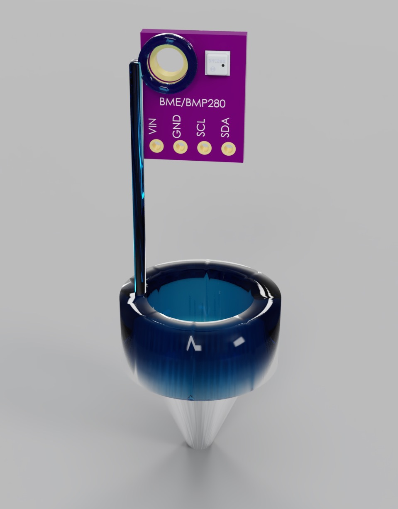

# BMP280-sensor-housing

3D printed housing for the BME/BMP280 temperature/humidity/pressure sensor.

Used with [OpenSCAD Customizer](https://en.wikibooks.org/wiki/OpenSCAD_User_Manual/Customizer).

Intended for use with RHRS humidity/radiation shield, 100mm deep x 20mm wide

